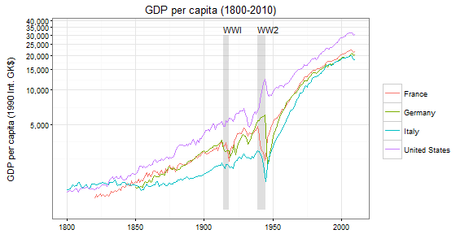

[](http://cran.r-project.org/package=maddison)
[](http://cran.r-project.org/web/packages/maddison)

Maddison Project Database
-------------------------

This package contains the [Maddison Project
Database](http://www.ggdc.net/maddison), which contains estimates of GDP
per capita for all countries in the world between AD 1 and 2016, in a
format amenable to analysis in R.

The database was last updated in 2018.

As per instructions on the Maddison Project website, please site the
data as follows:

> **Attribution requirement** - When using these data (for whatever
> purpose), please make the following reference: - Maddison Project
> Database, version 2018. Bolt, Jutta, Robert Inklaar, Herman de Jong
> and Jan Luiten van Zanden (2018), “Rebasing ‘Maddison’: new income
> comparisons and the shape of long-run economic development”, [Maddison
> Project Working paper
> 10](https://www.rug.nl/ggdc/historicaldevelopment/maddison/research) -
> For the references to the original research on individual countries,
> see Appendix A of Bolt et al. (2018).

Example use
-----------

``` r
# to install from Github
install.packages("remotes")
remotes::install_github("expersso/maddison")
```

``` r
library(maddison)
str(maddison)
```

    ## Classes 'tbl_df', 'tbl' and 'data.frame':    19873 obs. of  12 variables:
    ##  $ countrycode: chr  "AFG" "AFG" "AFG" "AFG" ...
    ##  $ country    : chr  "Afghanistan" "Afghanistan" "Afghanistan" "Afghanistan" ...
    ##  $ year       : num  1820 1870 1913 1950 1951 ...
    ##  $ cgdppc     : num  NA NA NA 2392 2422 ...
    ##  $ rgdpnapc   : num  NA NA NA 2392 2422 ...
    ##  $ pop        : num  3280 4207 5730 8150 8284 ...
    ##  $ i_cig      : chr  NA NA NA "Extrapolated" ...
    ##  $ i_bm       : chr  NA NA NA NA ...
    ##  $ iso2c      : chr  "AF" "AF" "AF" "AF" ...
    ##  $ iso3c      : chr  "AFG" "AFG" "AFG" "AFG" ...
    ##  $ continent  : chr  "Asia" "Asia" "Asia" "Asia" ...
    ##  $ region     : chr  "Southern Asia" "Southern Asia" "Southern Asia" "Southern Asia" ...

``` r
head(maddison)
```

    ##   countrycode     country year cgdppc rgdpnapc  pop        i_cig i_bm
    ## 1         AFG Afghanistan 1820     NA       NA 3280         <NA> <NA>
    ## 2         AFG Afghanistan 1870     NA       NA 4207         <NA> <NA>
    ## 3         AFG Afghanistan 1913     NA       NA 5730         <NA> <NA>
    ## 4         AFG Afghanistan 1950   2392     2392 8150 Extrapolated <NA>
    ## 5         AFG Afghanistan 1951   2422     2422 8284 Extrapolated <NA>
    ## 6         AFG Afghanistan 1952   2462     2462 8425 Extrapolated <NA>
    ##   iso2c iso3c continent        region
    ## 1    AF   AFG      Asia Southern Asia
    ## 2    AF   AFG      Asia Southern Asia
    ## 3    AF   AFG      Asia Southern Asia
    ## 4    AF   AFG      Asia Southern Asia
    ## 5    AF   AFG      Asia Southern Asia
    ## 6    AF   AFG      Asia Southern Asia

``` r
library(ggplot2)
library(dplyr)
library(scales)

# Data frame with annotations
df_annotate <- data.frame(
  xmin = c(1914, 1939),
  xmax = c(1918, 1945),
  ymin = c(900, 900), ymax = c(3e4, 3e4),
  label = c("WW1", "WW2"))

maddison %>%
  filter(iso2c %in% c("DE", "FR", "IT", "UK", "US")) %>%
  filter(year >= 1800) %>%
  ggplot() +
  geom_rect(aes(xmin = xmin, xmax = xmax, ymin = ymin, ymax = ymax),
            data = df_annotate, fill = "grey50", alpha = 0.25) +
  geom_text(aes(label = label, x = xmin, y = ymax), data = df_annotate, 
            vjust = 0, hjust = 0, nudge_y = 0.02, size = 3) +
  geom_line(aes(x = year, y = rgdpnapc, color = country)) +
  scale_y_log10(labels = comma, breaks = pretty_breaks(8)) +
  theme_bw(8) +
  labs(x = NULL, y = "GDP per capita (2011 US$)\n", color = NULL,
       title = "GDP per capita (1800-2016)")
```



Disclaimer
----------

This package is not affiliated with, nor endorsed by, the Maddison
Project. I aim to update it whenever the database is updated. If you
ever see that it is out-of-date, don’t hesitate to send a pull request
and/or remind me to update it.
