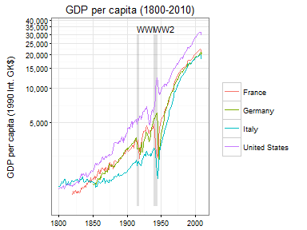

Maddison Project Dataset
------------------------

This package contains the [Maddison Project Dataset](http://www.ggdc.net/maddison/maddison-project/data.htm) with estimates of GDP per capita for all countries in the world between AD 1 and 2010 in a format amenable to analysis in R.

The database was last updated in January 2013.

As per instructions on the Maddison Project website, please site the data as follows:

| Purpose                                                  | Citation                                                                                                                                                                                             |
|----------------------------------------------------------|------------------------------------------------------------------------------------------------------------------------------------------------------------------------------------------------------|
| When using the data                                      | The Maddison-Project, <http://www.ggdc.net/maddison/maddison-project/home.htm>, 2013 version.                                                                                                        |
| When refering to underlying methodology and main results | Bolt, J. and J. L. van Zanden (2014). The Maddison Project: collaborative research on historical national accounts. The Economic History Review, 67 (3): 627-651. When using individual country data |
| When using individual country data                       | See country-source references in the appendix of Bolt and van Zanden (2014).                                                                                                                         |

Example use
-----------

``` r
# To install from Github
library(devtools)
install_github("expersso/maddison")
```

``` r
library(maddison)
str(maddison)
```

    ## Classes 'tbl_df', 'tbl' and 'data.frame':    45318 obs. of  9 variables:
    ##  $ year            : Date, format: "0001-01-01" "0730-01-01" ...
    ##  $ country_original: chr  "Austria" "Austria" "Austria" "Austria" ...
    ##  $ gdp_pc          : num  NA NA NA NA NA NA NA NA NA NA ...
    ##  $ country         : chr  "Austria" "Austria" "Austria" "Austria" ...
    ##  $ iso2c           : chr  "AT" "AT" "AT" "AT" ...
    ##  $ iso3c           : chr  "AUT" "AUT" "AUT" "AUT" ...
    ##  $ continent       : chr  "Europe" "Europe" "Europe" "Europe" ...
    ##  $ region          : chr  "Western Europe" "Western Europe" "Western Europe" "Western Europe" ...
    ##  $ aggregate       : logi  FALSE FALSE FALSE FALSE FALSE FALSE ...

``` r
head(maddison)
```

    ##         year country_original gdp_pc country iso2c iso3c continent
    ## 1 0001-01-01          Austria     NA Austria    AT   AUT    Europe
    ## 2 0730-01-01          Austria     NA Austria    AT   AUT    Europe
    ## 3 1000-01-01          Austria     NA Austria    AT   AUT    Europe
    ## 4 1150-01-01          Austria     NA Austria    AT   AUT    Europe
    ## 5 1280-01-01          Austria     NA Austria    AT   AUT    Europe
    ## 6 1300-01-01          Austria     NA Austria    AT   AUT    Europe
    ##           region aggregate
    ## 1 Western Europe     FALSE
    ## 2 Western Europe     FALSE
    ## 3 Western Europe     FALSE
    ## 4 Western Europe     FALSE
    ## 5 Western Europe     FALSE
    ## 6 Western Europe     FALSE

``` r
library(ggplot2)
library(dplyr)
library(scales)

# Data frame with annotations
df_annotate <- data.frame(
  xmin = as.Date(c("1914-01-01", "1939-01-01")),
  xmax = as.Date(c("1918-01-01", "1945-01-01")),
  ymin = c(900, 900), ymax = c(3e4, 3e4),
  label = c("WWI", "WW2"))

maddison %>%
  filter(iso2c %in% c("DE", "FR", "IT", "UK", "US")) %>%
  filter(year >= as.Date("1800-01-01")) %>%
  ggplot() +
  geom_rect(aes(xmin = xmin, xmax = xmax, ymin = ymin, ymax = ymax),
            data = df_annotate, fill = "grey50", alpha = 0.25) +
  geom_text(aes(label = label, x = xmin, y = ymax), data = df_annotate, 
            vjust = 0, hjust = 0, nudge_y = 0.02, size = 3) +
  geom_line(aes(x = year, y = gdp_pc, color = country)) +
  scale_y_log10(labels = comma, breaks = pretty_breaks(8)) +
  coord_cartesian(ylim = c(900, 35000)) +
  theme_bw(8) +
  labs(x = NULL, y = "GDP per capita (1990 Int. GK$)\n", color = NULL,
       title = "GDP per capita (1800-2010)")
```



Disclaimer
----------

This package is not affiliated with, nor endorsed by, the Maddison Project. I aim to update it whenever the database is updated. If you ever see that it is out-of-date, don't hesitate to send a pull request and/or remind me to update it.
